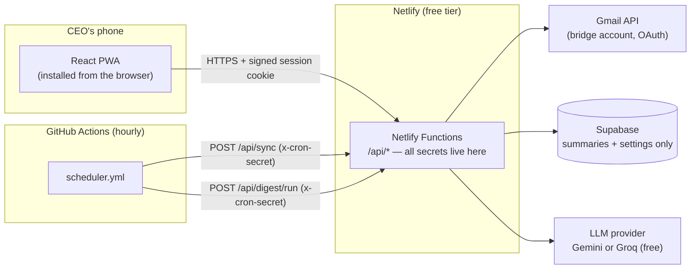

# CEO Mail Agent

A self-hosted, $0/month email agent for a single executive. A dedicated "bridge" Gmail account aggregates the CEO's office mailbox (`walid@dubaiconsultancy.ae`); the agent watches that inbox hourly, summarizes and categorizes every new email with a free-tier LLM (Gemini or Groq), extracts deadlines and action items, and emails the CEO one morning digest. When the CEO wants to reply, the agent drafts the email in his own voice using a style profile learned from his sent mail — but it **never sends, deletes, or archives anything on its own**. The only automated outbound email is the daily digest to the CEO himself; everything else requires an explicit in-app confirmation.

The app is a React 18 + Vite 5 PWA designed for a non-technical CEO on a Huawei phone (no Play Store — it installs straight from the browser). The UI talks only to Netlify Functions; those functions hold every secret and talk to the Gmail API, Supabase (which stores summaries and metadata only — never email bodies), and the chosen LLM provider. A GitHub Actions cron ticks the sync and digest endpoints hourly. Every service runs on a verified free tier — see [COSTS.md](COSTS.md) for the numbers and [PRIVACY.md](PRIVACY.md) for exactly what is stored where.

## Features

- Multiple mailboxes in one app: connect several Gmail accounts (OAuth) and any IMAP/SMTP mailbox (office cPanel, Outlook, Yahoo) side by side — per-account writing styles and send-as aliases, an account switcher in the inbox, one merged digest, and an in-app Guide (`/guide`) that walks through connecting every kind of mailbox
- Real-time arrival: Gmail push notifications (Cloud Pub/Sub) land new mail in the app within seconds; the hourly scheduler and on-open sync are the safety net, and the inbox quietly refreshes itself while open
- New mail is fetched, batch-summarized, and categorized on arrival; the first-ever sync backfills the last 30 days of inbox history
- One-line TL;DR, participants, deadlines, action-required flag, and task list per email
- Automatic reply drafts: mail the AI judges genuinely reply-worthy arrives with a reply already written in the CEO's voice ("Draft ready" in the inbox) — stored, never auto-sent
- Configurable categories (client, government, finance, internal, vendor, newsletter, system, personal by default)
- Morning digest email: counts by category, top action items, upcoming deadlines, and a 2–3 sentence executive brief — send hour and timezone configurable in Settings
- Reply and compose drafting in the CEO's voice, driven by a style profile rebuilt from his actual sent mail
- Human-in-the-loop sending: every outgoing email shows recipient, subject, and body and requires an explicit tap to send (via the bridge account's "Send mail as" alias)
- Passcode login with a signed, HttpOnly 30-day session cookie — no user accounts, no browser-side secrets
- Swappable LLM provider (Gemini or Groq, both free tier) from Settings
- Installable PWA: works from Huawei Browser, Chrome, or Safari with an app icon on the home screen
- Executive design system: Bodoni Moda display serif + Jost, warm-ivory and navy/gold palette, self-hosted fonts, subtle staggered motion that respects reduced-motion preferences
- Resilient by design: LLM rate limits are retried with backoff; anything still unsummarized or undrafted is picked up on the next sync

## Rolling out to more people

Each person gets their **own private deployment** — that is what keeps every tier free and every mailbox isolated: their own bridge Gmail account, their own Supabase project, their own Netlify site, and their own passcode. To onboard the CEO (or a teammate), repeat SETUP.md with their accounts; the code never changes. A demo mode (`npm run dev:demo`) runs the full UI on realistic sample data with no accounts at all — ideal for showing the app before connecting anything.

## Architecture



Email bodies are fetched live from Gmail per request and never persisted; Supabase holds metadata, summaries, settings, and the AES-256-GCM-encrypted refresh token. The browser never talks to Supabase, Gmail, or the LLM directly.

## File structure

```text
ceo-mail-agent/
├── index.html                       # PWA entry document
├── vite.config.ts                   # Vite + React + PWA plugin (manifest, service worker)
├── tailwind.config.js               # Tailwind setup (mobile-first UI)
├── postcss.config.js                # PostCSS pipeline for Tailwind
├── tsconfig.json                    # strict TypeScript config for the browser app
├── netlify.toml                     # build command, functions dir, SPA fallback redirect
├── .env.example                     # every environment variable, documented
├── .github/
│   └── workflows/scheduler.yml      # hourly cron → POST /api/sync + /api/digest/run
├── public/                          # PWA icons (favicon, 192/512, maskable, apple-touch)
├── shared/
│   └── types.ts                     # contracts shared by UI and API — types only
├── src/                             # the React PWA
│   ├── main.tsx                     # bootstraps React + router
│   ├── App.tsx                      # routes, auth gate, app shell
│   ├── index.css                    # Tailwind entry + base styles
│   ├── lib/api.ts                   # typed fetch wrapper for /api/*
│   └── ...                          # screens & components (inbox, email, compose,
│                                    #   digest, settings)
├── netlify/
│   ├── tsconfig.json                # strict TypeScript config for the serverless side
│   ├── functions/                   # API endpoints, one file per route (auth, sync,
│   │                                #   emails, draft, send, digest, style, settings)
│   └── lib/                         # server-only modules
│       ├── env.ts                   # required/optional env-var access
│       ├── http.ts                  # request helpers, session + cron-secret guards
│       ├── session.ts               # passcode login, signed HttpOnly cookie
│       ├── crypto.ts                # AES-256-GCM for the Gmail refresh token
│       ├── gmail.ts                 # Gmail API client (OAuth, fetch, send)
│       ├── supabase.ts              # service-role Supabase client
│       ├── store.ts                 # typed reads/writes for every table
│       ├── llm.ts                   # Gemini/Groq calls with 429 retry + backoff
│       ├── prompts.ts               # all LLM prompts + default categories
│       └── sync-core.ts             # fetch new mail → batch summarize → store
└── supabase/
    └── schema.sql                   # entire database schema — run once in SQL Editor
```

## Local development

Requires Node.js 20 or newer.

```bash
npm install

# UI only — fastest loop. /api/* calls will fail because the serverless
# functions are not running; use it for layout and component work.
npm run dev

# UI + functions together. Requires the Netlify CLI and the environment
# variables from .env.example (netlify dev injects them from a linked site,
# or put them in a local .env — never commit it).
npx netlify dev

# Typecheck everything (browser app AND serverless code). Run before pushing.
npm run check
```

The functions depend on live services (Supabase, Gmail OAuth, an LLM key), so the simplest end-to-end test environment is a real deployment — Netlify deploys are free and take about a minute.

## Deploying

The complete, browser-only walkthrough — written for a non-technical operator, no terminal required — is in **[SETUP.md](SETUP.md)**. Short version for developers:

1. Push the repo to a **public** GitHub repository (public = unlimited free Actions minutes for the scheduler).
2. Create a Supabase project and run `supabase/schema.sql` in the SQL Editor.
3. Create a Google Cloud project on the bridge Gmail account: enable the Gmail API, configure the OAuth consent screen, **publish it to Production** (unverified is fine for a personal app — Testing-status refresh tokens expire every 7 days), and create a Web OAuth client.
4. Get a free Gemini key from AI Studio (or a Groq key).
5. Import the repo into Netlify; `netlify.toml` supplies the build settings. Set every variable from [.env.example](.env.example), deploy, then set `SITE_URL` and add `{SITE_URL}/api/auth/google/callback` as the OAuth redirect URI.
6. Add `SITE_URL` and `CRON_SECRET` as GitHub Actions secrets and enable the `mail-agent-scheduler` workflow.

## More docs

- [SETUP.md](SETUP.md) — step-by-step deployment for a non-technical person, entirely in the browser
- [COSTS.md](COSTS.md) — verified free-tier limits vs. actual usage; why the total is $0/month
- [PRIVACY.md](PRIVACY.md) — what is stored, what is never stored, where email content travels, and how to revoke everything
